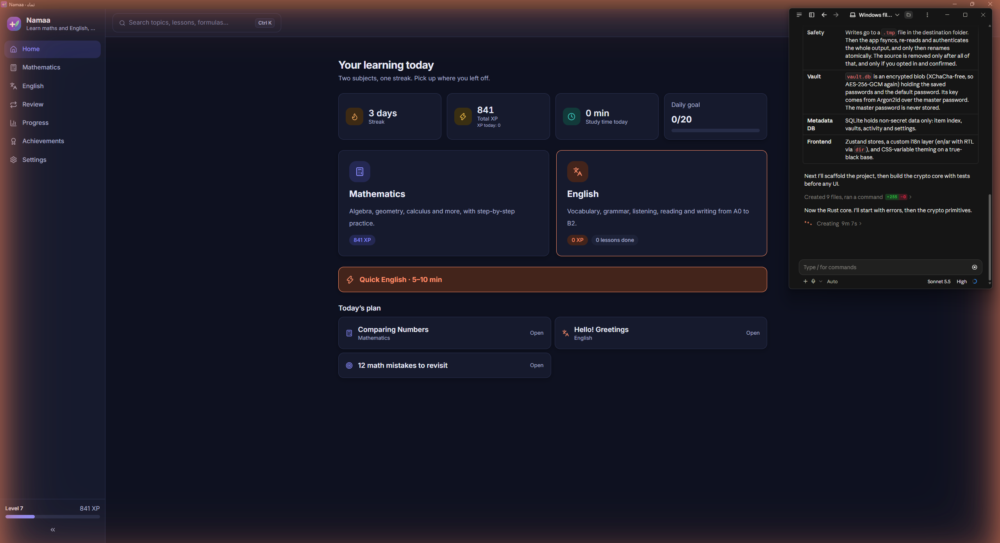
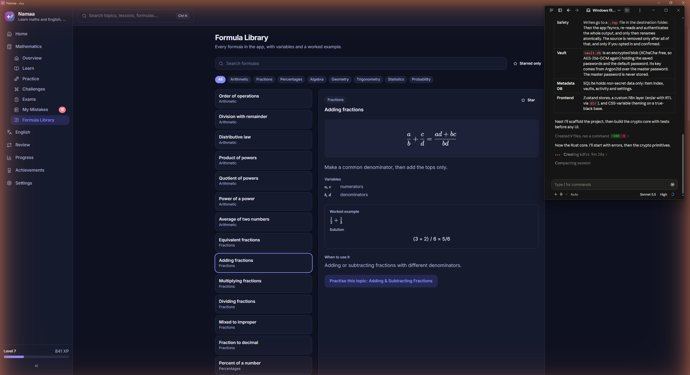
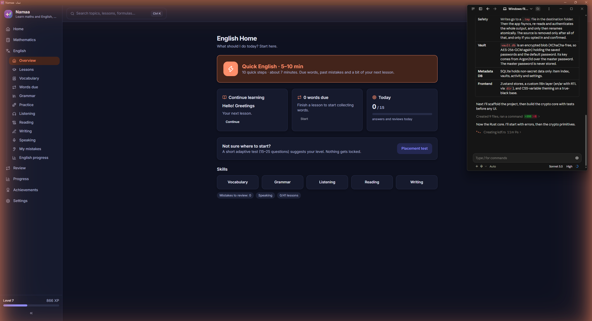
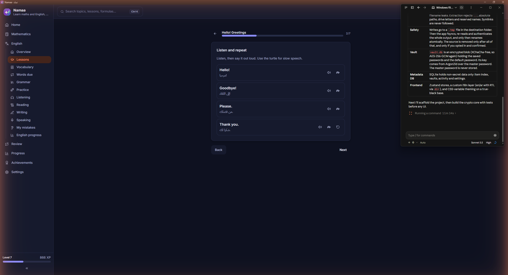
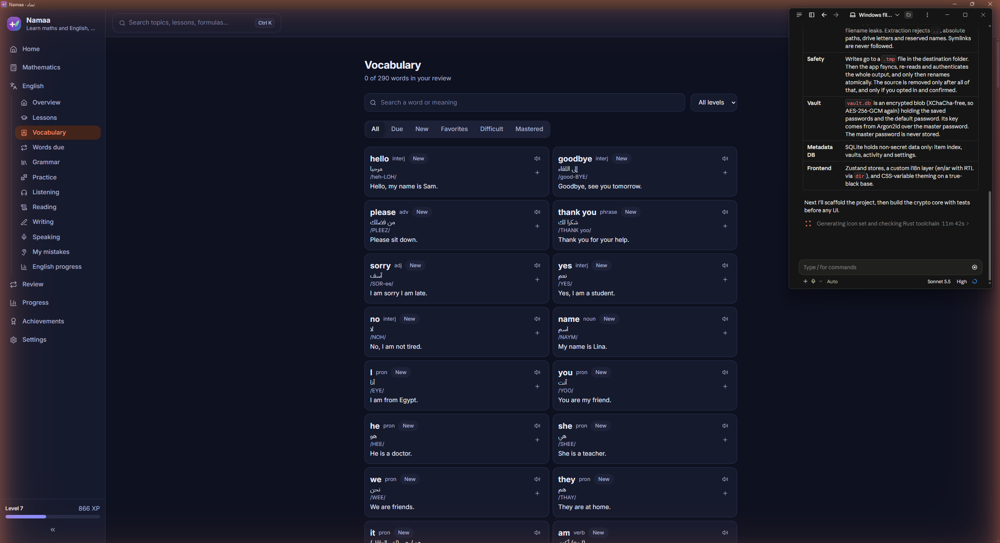
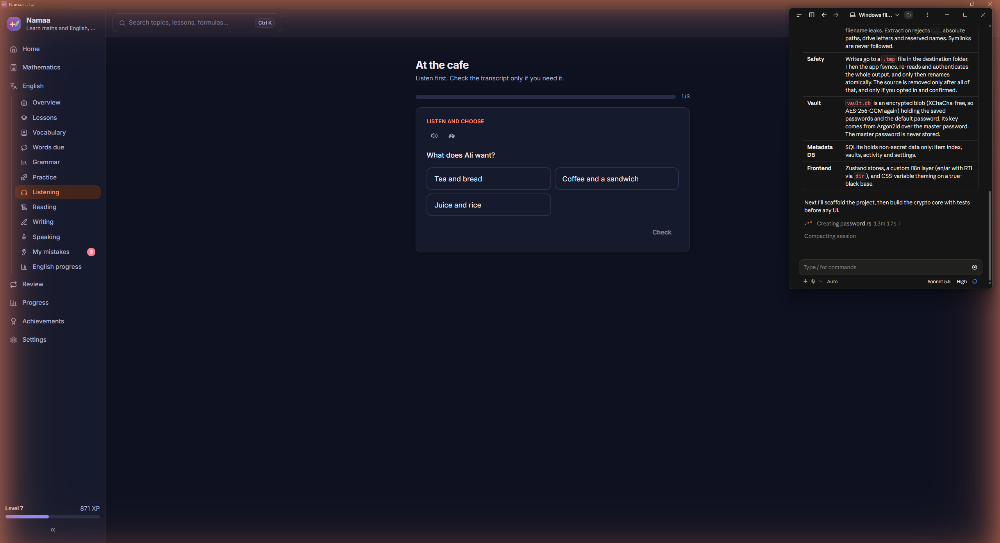
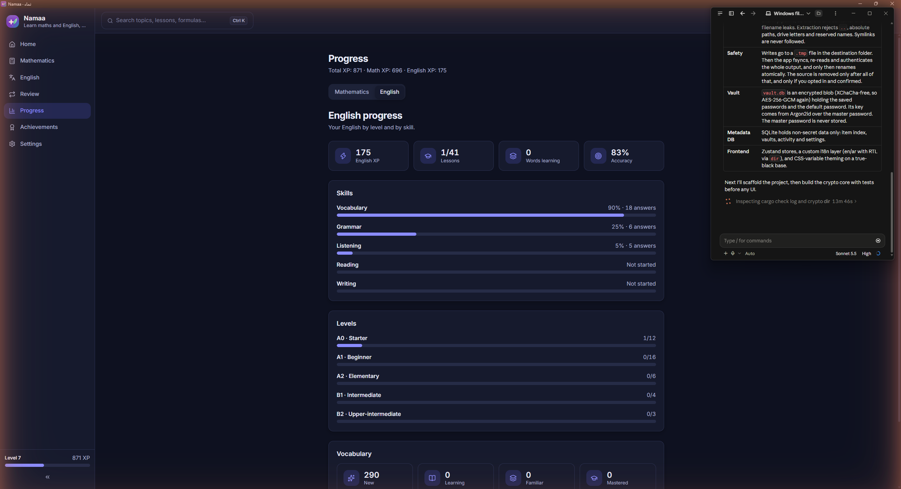
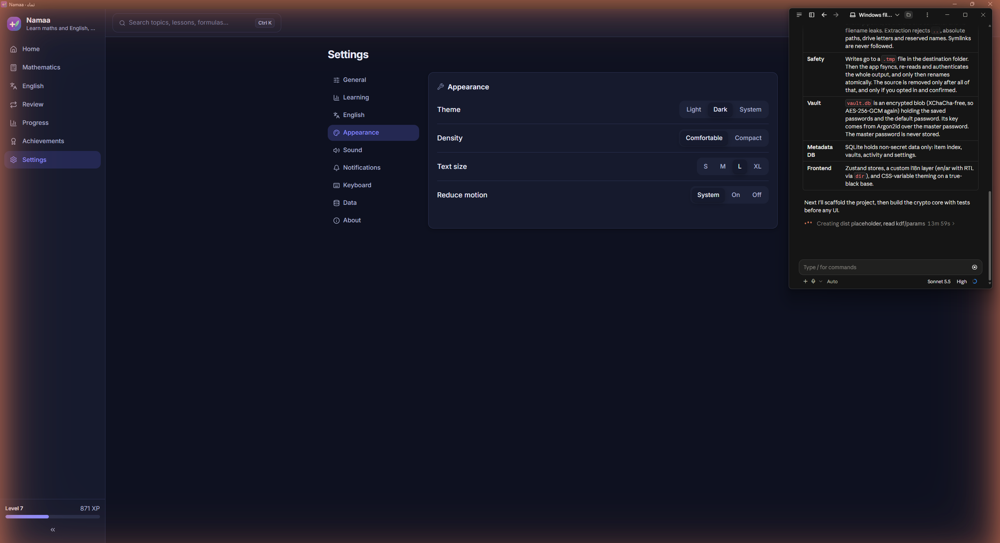
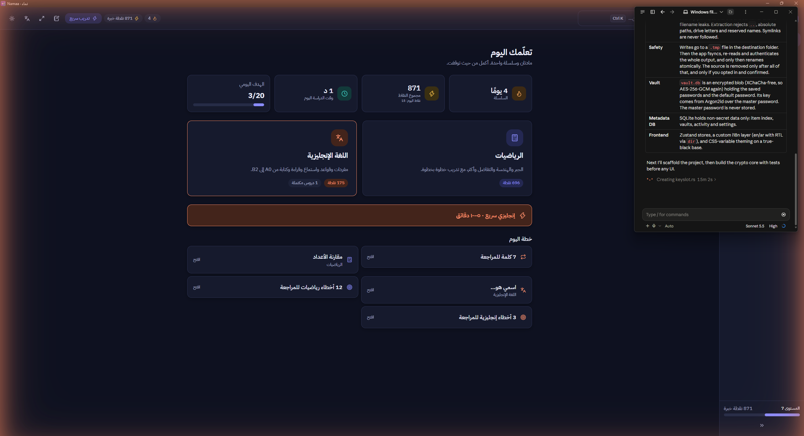
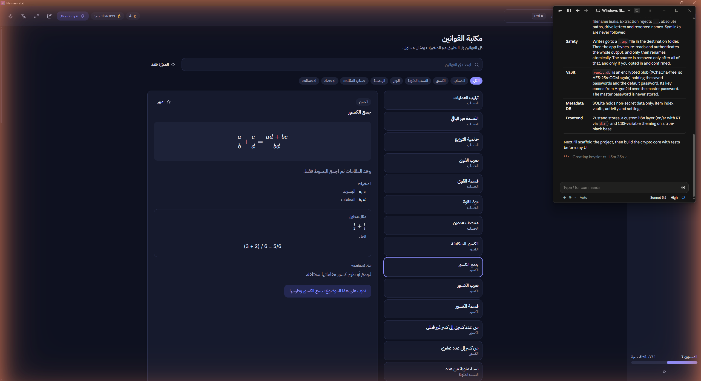

<div align="center">


# Namaa | نماء

**A modern offline-first personal learning platform for Mathematics and English**

منصة تعلّم شخصية تعمل دون إنترنت للرياضيات واللغة الإنجليزية


</div>

## Overview

Namaa is a desktop app for learning Mathematics and English side by side, in Arabic or English. Lessons, practice, spaced review and progress tracking all run locally on your machine and are stored in a local SQLite database. An internet connection is only needed for the optional cloud neural voices.

## Screenshots

<table>
  <tr>
    <td></td>
    <td></td>
  </tr>
  <tr>
    <td align="center">Home</td>
    <td align="center">Mathematics</td>
  </tr>
  <tr>
    <td></td>
    <td></td>
  </tr>
  <tr>
    <td align="center">English home</td>
    <td align="center">English lesson</td>
  </tr>
  <tr>
    <td></td>
    <td></td>
  </tr>
  <tr>
    <td align="center">Vocabulary</td>
    <td align="center">Listening</td>
  </tr>
  <tr>
    <td></td>
    <td></td>
  </tr>
  <tr>
    <td align="center">Progress</td>
    <td align="center">Settings</td>
  </tr>
  <tr>
    <td></td>
    <td></td>
  </tr>
  <tr>
    <td align="center">Arabic home (RTL)</td>
    <td align="center">Arabic formula library</td>
  </tr>
</table>

## Features

### Mathematics
- Guided lessons, topic practice and challenges
- Formula Library with rendered math (KaTeX), including fractions
- Scratchpad, exams and weekly goals
- Mistake tracking and review

### English
- Lessons, vocabulary with words due for review, and grammar topics
- Practice, listening and reading exercises
- Writing and speaking sections
- A "My mistakes" list and English-specific progress

### Pronunciation
- Natural neural voices through **ElevenLabs** or **Azure Neural Speech**, using your own key
- American and British accents, normal and slow playback, replay
- Device (system) voice as an offline fallback
- Generated audio is cached locally, so repeated words and sentences play offline

### Across the app
- Spaced review, progress, achievements, a daily plan and a placement check
- Global search (Ctrl+K)
- Light and dark themes
- Settings for learning, appearance, sound, notifications, keyboard and data (backup/restore)

## Arabic & English

- Full interface in Arabic (RTL) or English (LTR), switchable in Settings.
- English text, words and sentences stay left-to-right inside Arabic screens.
- Math expressions are always rendered left-to-right, even in the middle of Arabic text.

## Offline-First

- All lessons, practice, review and progress work with no connection; data lives in a local SQLite database.
- Cloud neural voices need an internet connection, unless the audio was already generated and cached. Cached audio plays offline.
- If the cloud is unavailable, pronunciation falls back to the system voice.

## Tech Stack

| Layer | Technology |
| --- | --- |
| Shell | Tauri 2 (Rust) |
| UI | React 19, TypeScript, Tailwind CSS 4, Vite |
| State | Zustand |
| Math rendering | KaTeX |
| Icons | lucide-react |
| Storage | SQLite via `rusqlite` (bundled) |
| TTS backend | `reqwest`, `sha2`, `keyring` |
| Tests | Vitest, `cargo test` |

## Architecture

```
.
├── src/
│   ├── components/      shared UI
│   ├── content/         lessons and learning content
│   ├── database/        local data access
│   ├── domain/          mastery and scoring logic
│   ├── english-engine/  English exercise generation
│   ├── math-engine/     math question generation
│   ├── features/        home, learning, practice, formulas, english, settings, ...
│   ├── i18n/            Arabic / English strings
│   ├── lib/             tauri bridge, TTS, helpers
│   └── stores/          Zustand stores
├── src-tauri/
│   ├── src/             db.rs, tts.rs, logging.rs, lib.rs, main.rs
│   └── tauri.conf.json
└── docs/                screenshots and assets
```

## Getting Started

Requirements: Node.js with npm, the Rust toolchain, and the [Tauri 2 prerequisites for Windows](https://tauri.app/start/prerequisites/) (WebView2, MSVC build tools).

```bash
npm install
npm run tauri dev
```

Other scripts:

```bash
npm run dev         # web UI only (Vite)
npm run typecheck   # tsc --noEmit
npm run test        # Vitest
```

## Production Build

```bash
npm run tauri build
```

The NSIS installer is written to `src-tauri/target/release/bundle/nsis/` (`Namaa_1.0.0_x64-setup.exe`).

## Neural TTS Setup

1. Create an API key with ElevenLabs or Azure Speech (Azure also needs a region).
2. In Namaa open **Settings → English → Pronunciation**, choose a provider, paste the key and press Save.
3. Pick an accent and voice, then use **Play sample** to test.

The key is sent straight to the Rust side and stored in the Windows Credential Manager. It is never hardcoded, never kept in app files or the database, and never sent back to the UI. Text is sent to the provider only when you play pronunciation with a cloud voice.

## Data & Privacy

- Progress, settings and history are stored locally in SQLite.
- No account, telemetry or sync.
- The only network traffic is optional text-to-speech requests to the provider you configure.
- The audio cache lives in the app data folder and can be cleared from Settings.

## Testing

| Check | Result |
| --- | --- |
| `npx tsc --noEmit` | clean |
| Vitest | 380 / 380 passed (12 files) |
| `cargo test` | 17 passed |
| `cargo clippy --all-targets` | no warnings |

```bash
npm run check                              # typecheck + Vitest
cargo test --manifest-path src-tauri/Cargo.toml
```

## Project Status

A personal project under active development. Currently targets Windows.

## Roadmap

- Local neural TTS (no cloud needed)
- Pronunciation scoring
- More lesson content
- Richer analytics
